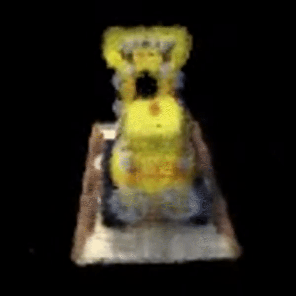
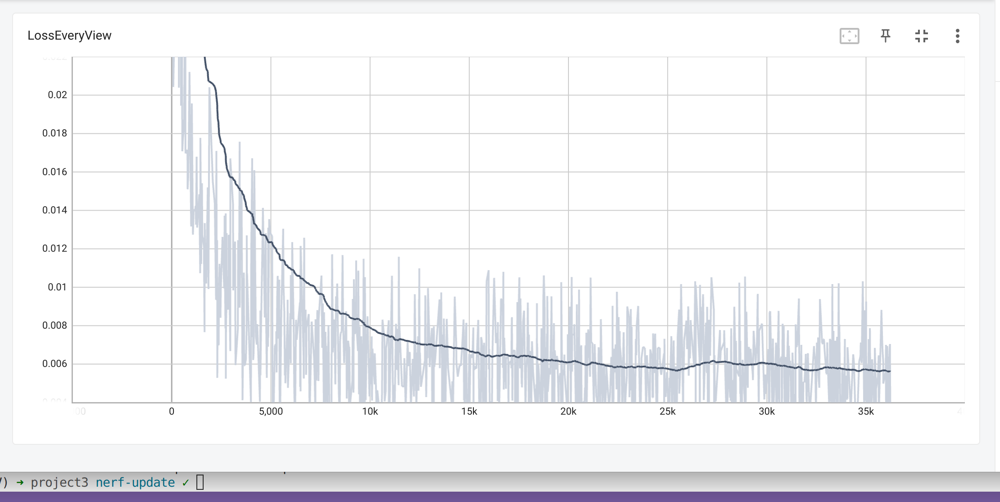
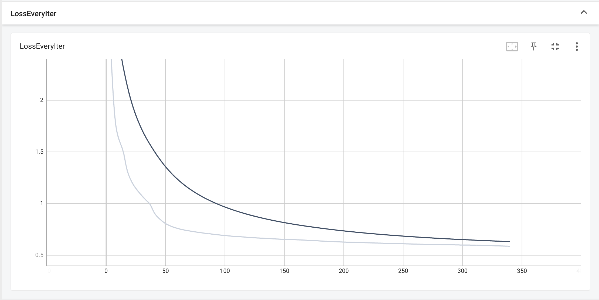

# Structure From Motion (SfM) and NeRF
Reconstruction of a 3d scene from a set of images with different view points (camera in motion)

## Results

### NeRF

### Training Progress

## Collaborators
Sai Ramana Kiran - spinnamaraju@wpi.edu

Radha Saraf - rrsaraf@wpi.edu
