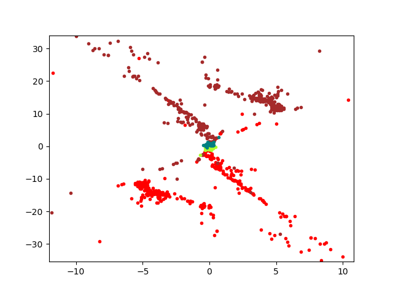

# Structure From Motion (SfM) and NeRF
Reconstruction of a 3d scene from a set of images with different view points (camera in motion)

## Results

### NeRF

<!-- #### Training Progress

 -->

### Structure from Motion (SfM)

#### Matches using RANSAC

##### Before 

##### After

#### Epipolars

#### Camera Disambiguation using Chierality condition

##### Initial Triangulation

##### After Disambiguation

#### NonLinear Triangulation

#### Camera Registration using Perspective-n-Points (PnP)

#### NonLinear PnP

#### Bundle Adjustment

## Collaborators
Sai Ramana Kiran - spinnamaraju@wpi.edu

Radha Saraf - rrsaraf@wpi.edu
